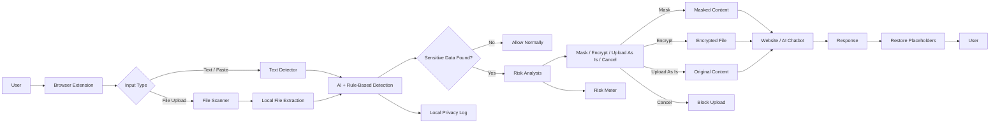

ShieldAI
an AI-powered browser privacy layer that detects sensitive information in text and files, masks or encrypts it locally, and prevents accidental data leaks before anything is shared online.

Team Name: COGNIVEX

Member	Contribution

VAISHNAA SHRI.P	[Contribution]

RATCHITHA KATHIRAVAN VEDHAVALLI	[Contribution]

KAVISH RAHAV D P	[Contribution]

SIVA PRASANTHAM K	[Contribution]

Problem Statement
The Problem:
Students and professionals frequently paste or upload sensitive information—such as phone numbers, resumes, credentials, API keys, and confidential documents—into AI chatbots, websites, forms, and other online platforms.

Most users do not realize that pasting or uploading is a form of data sharing. Once the information leaves their device, they may lose control over it. Existing enterprise Data Loss Prevention (DLP) tools are generally designed for organizations rather than individual users.

Why We Chose This Problem
Accidental data exposure is an everyday problem that can happen with a single paste or upload. We chose this problem because individuals need a simple, real-time privacy layer that protects sensitive information before it leaves their browser, without requiring technical knowledge or complex security software.

Solution:

PasteShield is a browser extension that acts as an on-device privacy layer between the user and the websites they use.

It detects sensitive information in text and uploaded files, identifies the risk, and gives the user the option to mask, encrypt, upload as is, or cancel before the data is shared.

All detection and masking happen locally on the user's device, so the original sensitive data is not sent to PasteShield's servers.
Key Features
Sensitive Data Detection: Detects Aadhaar, PAN, UPI IDs, phone numbers, emails, API keys, passwords, and other sensitive information using AI and rule-based detection.
Reversible Text Masking: Replaces sensitive values with placeholders before sending text to AI tools while maintaining the context needed for useful responses.
Upload Guard: Scans files locally before upload and provides options to mask, encrypt, upload as is, or cancel.
Risk Meter: Clearly shows what sensitive information has been detected and its risk level.
Regional Language Support: Handles English, Tamil, Hindi, and mixed-language/Tanglish text.
Local Privacy Log: Keeps a private record of masking actions without sending the data to a server.

Innovation and Differentiation

PasteShield moves privacy protection from **after-the-leak detection to before-the-leak prevention**. Instead of asking users to manually remove sensitive information, it automatically detects sensitive data at the point where it is about to leave the browser.

Unlike conventional enterprise DLP tools, PasteShield is designed for **individual users** and works locally in the browser. Its key differentiators are:

* **Real-time protection:** Detects sensitive information during paste and file upload.
* **On-device processing:** Sensitive content is analyzed locally without sending it to a central server.
* **Reversible masking:** Replaces sensitive values with placeholders while preserving the context of the user's prompt.
* **Indian data awareness:** Supports identifiers such as Aadhaar, PAN, and UPI IDs, along with mixed-language text.
* **User-controlled protection:** Users can choose to mask, encrypt, upload as is, or cancel.
* **Multi-purpose architecture:** The same masking engine can later be extended to email, document sharing, screen sharing, and printing workflows.

Technical Implementation

Architecture

### Technology Stack

| **Category**    | **Technologies**                                           |
| --------------- | ---------------------------------------------------------- |
| Frontend        | HTML, CSS, JavaScript, Browser Extension APIs              |
| Backend         | N/A                                                        |
| Database        | Browser Local Storage / IndexedDB                          |
| AI / ML         | Lightweight local NLP model + rule-based pattern detection |
| Infrastructure  | Browser / User Device                                      |
| APIs / Services | Browser Extension APIs; N/A for external cloud APIs        |

### How It Works

1. **Input Interception:** The browser extension monitors text paste, text entry, drag-and-drop, and file-upload actions.
2. **Local Detection:** Text and extracted file content are analyzed on the user's device using rule-based detectors and a lightweight local AI/NLP model.
3. **Sensitive Data Identification:** The system identifies information such as Aadhaar, PAN, phone numbers, emails, UPI IDs, API keys, passwords, and names.
4. **Risk Assessment:** Detected information is categorized according to its sensitivity and displayed through a simple risk meter.
5. **User Decision:** For risky content, PasteShield provides four actions: **Mask, Encrypt, Upload As Is, or Cancel**.
6. **Privacy-Preserving Upload:** Masked or encrypted content is sent to the target website instead of the original sensitive information.
7. **Context Preservation:** For text prompts, sensitive values are replaced with unique placeholders so the AI can understand the surrounding context.
8. **Response Handling:** When applicable, placeholders in the AI response can be mapped back to the original values locally.
9. **Local Logging:** Masking and security actions are recorded locally on the user's device. No sensitive content is sent to a PasteShield server.

